# Versus Engine

**A category-agnostic engine that turns database records into animated "X vs Y" comparison videos — cars, phones, laptops, or anything else — without writing a line of category-specific code.**

Feed it two or more products from Postgres, and it scores the most interesting specs, generates a title/description/verdict, and renders a fully animated, scored, narrated MP4 (plus a 9:16 Shorts cut and A/B thumbnail variants) through [Remotion](https://www.remotion.dev). Add a new category — drones, motorcycles, whatever — by inserting rows, not code.

<p align="center">
  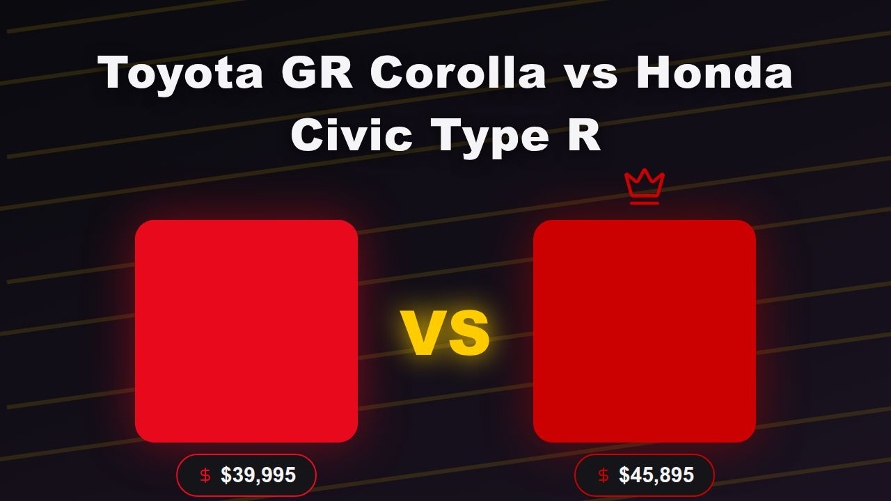
</p>

---

## Why

Faceless comparison channels are popular and formulaic — which is exactly what makes them automatable. Versus Engine separates the two things that normally get tangled together in a one-off video project:

- **Data**: a category-agnostic Postgres schema (`Category → Brand → Product → SpecValue`) that any domain can be modeled in.
- **Rendering**: a single Zod-validated `VideoInput` contract that a Remotion composition renders — the renderer has no idea what a "car" is, it just draws contenders, rounds, and a verdict.

Everything in between — round selection, scoring, AI metadata, TTS narration, thumbnails, publishing, analytics — is generic pipeline code that works the same whether you're comparing GPUs or golden retrievers.

## Key features

### 🎬 Six-scene animated video template, in any theme

Every render walks through **Hook Intro → Contender Reveal → Spec Battles → running Scoreboard → Winner Reveal → Outro**, with spring entrances, animated bar/gauge/counter/badge rounds, scene transitions, and a synced, ducked music + SFX bed — all driven by one JSON payload.

<table>
<tr>
<td>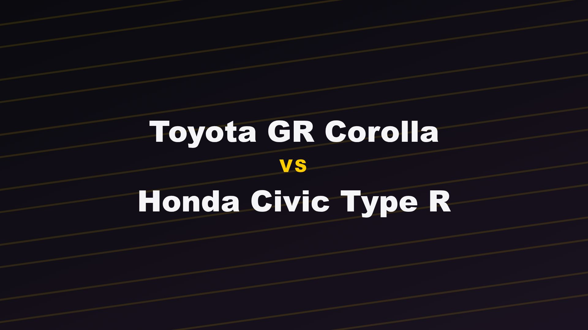</td>
<td>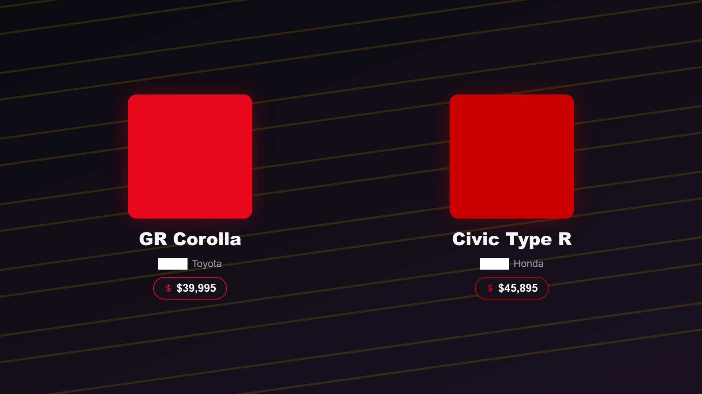</td>
</tr>
<tr>
<td>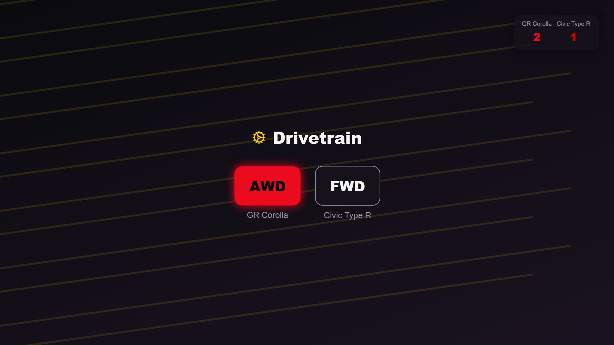</td>
<td>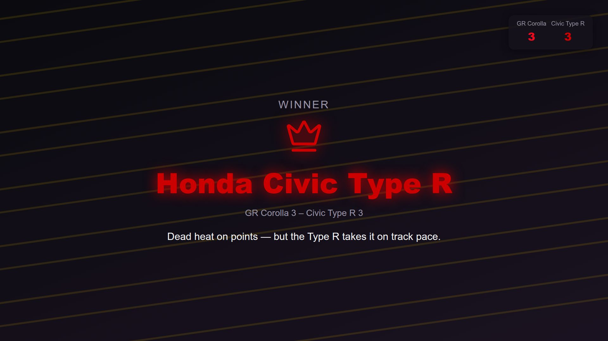</td>
</tr>
</table>

### 🎨 Per-category themes, zero hardcoded colors

Each `Category` carries a `themeKey` (color palette, typography, background motif) that the renderer looks up at render time — scenes never hardcode a hex value or know which category they're drawing.

<table>
<tr>
<td align="center"><br><sub><b>speed</b> — cars</sub></td>
<td align="center">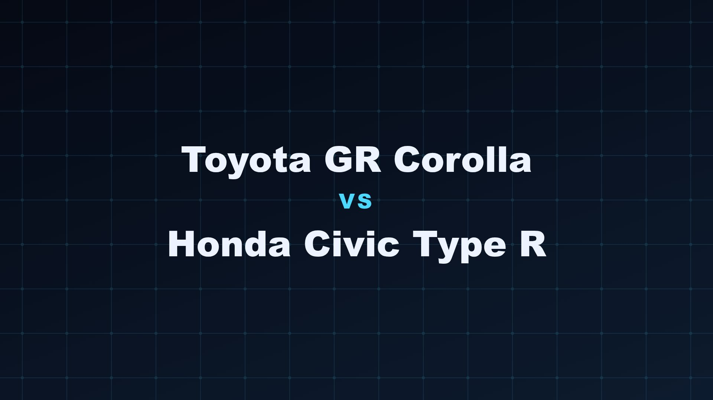<br><sub><b>circuit</b> — phones</sub></td>
<td align="center">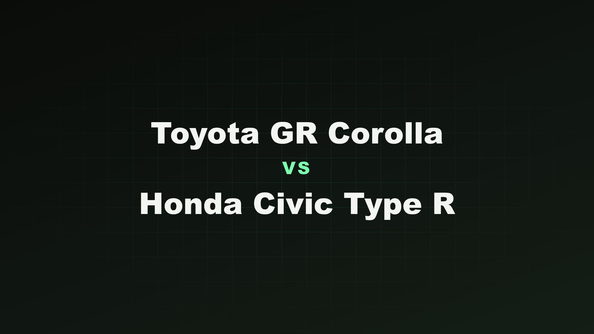<br><sub><b>grid</b> — laptops</sub></td>
</tr>
</table>

### 🧮 Data-driven round selection

`priorityWeight × normalizedDifference` scores every comparable spec, keeps the top 6–8, always includes price, caps badge (non-numeric) rounds at one, and guarantees each contender wins at least one round when the data allows — close matchups retain viewers better than blowouts.

### 🖼️ A/B thumbnail testing

Every render produces **two** distinct branded thumbnails from the same data — a dark two-panel layout and a bold diagonal color-split — so you can pick a winner per video instead of guessing.

<table>
<tr>
<td align="center"><br><sub>Variant A</sub></td>
<td align="center">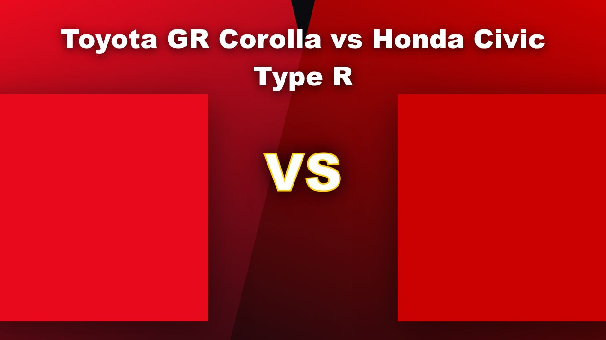<br><sub>Variant B</sub></td>
</tr>
</table>

### 📊 Dashboard: browse, build, preview, render

A Next.js admin app to browse the product catalog, queue a comparison build, live-preview it with a real Remotion `<Player>` embed (no render needed), and track render/publish status end to end.

<table>
<tr>
<td>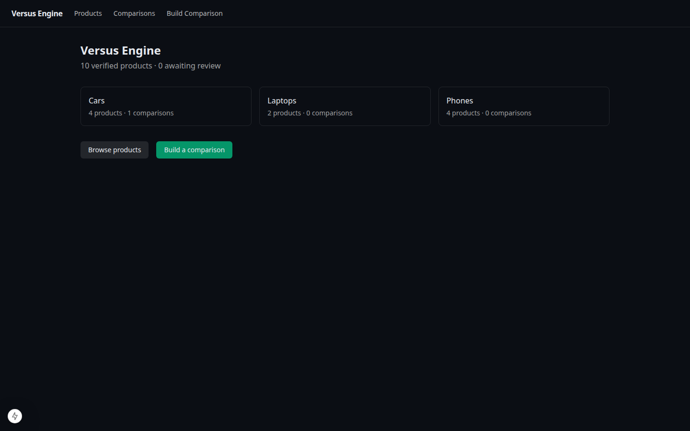</td>
<td>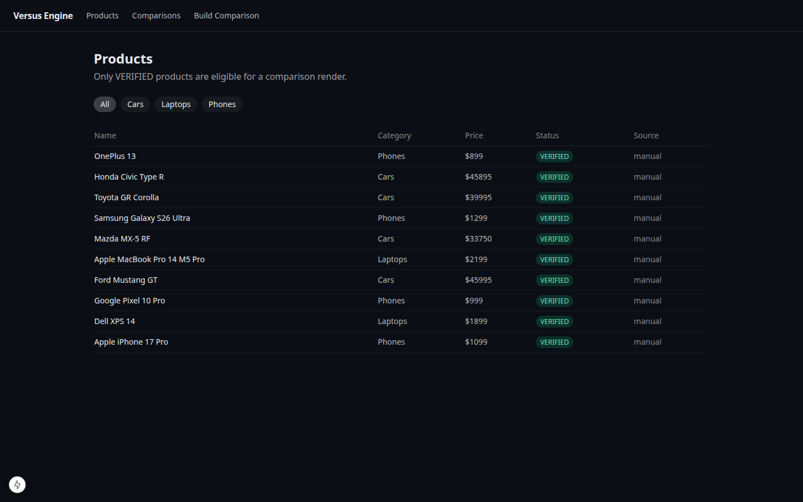</td>
</tr>
<tr>
<td>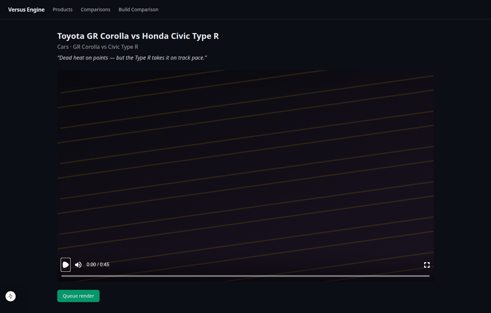</td>
<td>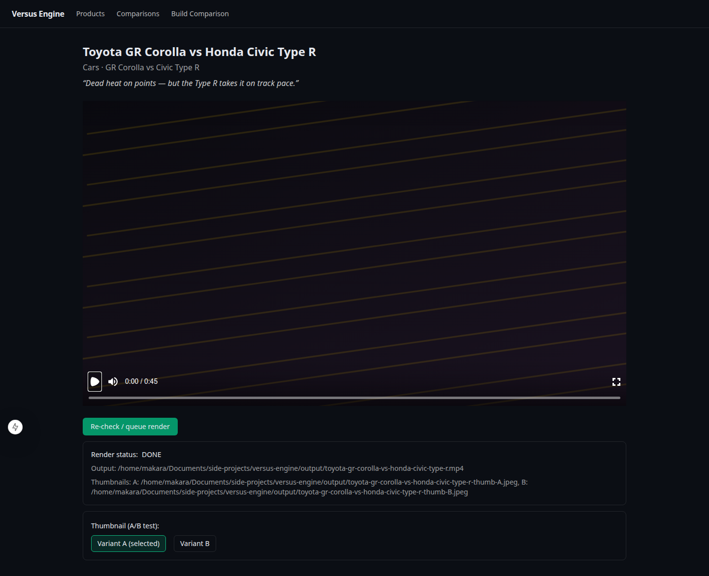</td>
</tr>
</table>

### 🔊 Optional AI narration track

An optional, pluggable TTS layer (`pnpm batch --narration`) scripts a hook line, one line per round, and a verdict line straight from the frozen video data, synthesizes it, and drops it into the composition's audio track with automatic music ducking — off by default, one flag to turn on.

### ☁️ Scales from a laptop to Remotion Lambda

Render locally for iteration, or flip `RENDER_TARGET=lambda` to fan renders out to AWS Lambda for parallel batch runs — same worker code, same job queue, no template changes.

### 📈 Analytics feedback loop

`pnpm analytics:sync` pulls per-video stats and audience-retention curves from the YouTube Analytics API and correlates them back to *individual rounds* using the exact scene timing the renderer used. That retention data quietly nudges future round selection toward the specs that actually keep people watching.

### 🤖 Built for automation

Idempotent BullMQ workers for ingest/render/publish, a `pnpm batch` CLI that builds, renders, schedules, and publishes a whole category's worth of comparisons overnight, and a frozen `videoJson` payload on every `Comparison` row so any video can be re-rendered byte-identical later.

---

## Architecture

```
┌──────────────────────────────────────────────────────────────────┐
│                        DASHBOARD (Next.js)                       │
│   browse products · build comparisons · live Remotion <Player>   │
│   preview · queue renders · A/B thumbnail picker · track uploads │
└───────────────┬──────────────────────────────────────────────────┘
                │
┌───────────────▼──────────────────────────────────────────────────┐
│                       CORE API + JOB QUEUE                       │
│                    (Node + BullMQ on Redis)                      │
└──┬───────────────┬────────────────┬───────────────┬──────────────┘
   │               │                │               │
┌──▼─────────┐ ┌───▼──────────┐ ┌───▼──────────┐ ┌──▼───────────┐
│ INGESTION  │ │  COMPARISON  │ │   RENDER     │ │  PUBLISHER   │
│ vPIC API,  │ │  scoring +   │ │  Remotion    │ │  YouTube API,│
│ CSV, AI    │ │  retention-  │ │  local or    │ │  thumbnails, │
│ normalizer │ │  aware round │ │  Lambda +    │ │  scheduling, │
│            │ │  selection   │ │  A/B thumbs  │ │  analytics   │
└──┬─────────┘ └───┬──────────┘ └───┬──────────┘ └──┬───────────┘
   │               │                │               │
┌──▼───────────────▼────────────────▼───────────────▼──────────────┐
│              PostgreSQL (Prisma)  +  S3/R2 asset store           │
└──────────────────────────────────────────────────────────────────┘
```

The renderer only ever consumes one Zod-validated `VideoInput` payload — see [`packages/shared/src/video-input.ts`](packages/shared/src/video-input.ts). Everything upstream of it maps a category's `SpecDefinition` rows into that shape; nothing downstream of it knows what a "car" is.

## Tech stack

| Layer | Choice |
|---|---|
| Video engine | Remotion 4.x |
| Language | TypeScript everywhere |
| Monorepo | pnpm workspaces + Turborepo |
| Database | PostgreSQL 16 + Prisma |
| Queue | Redis + BullMQ |
| Dashboard | Next.js 15 (App Router) + Tailwind |
| AI assist | Anthropic API (metadata) + OpenAI TTS (optional narration) |
| Rendering at scale | `@remotion/renderer` locally → Remotion Lambda |
| Publishing | YouTube Data API v3 + YouTube Analytics API v2 |

## Getting started

```bash
git clone git@github.com:lymakara-dev/versus-engine.git
cd versus-engine
pnpm install
docker compose up -d          # Postgres, Redis, MinIO
cp .env.example .env          # fill in secrets you actually need
pnpm db:migrate
pnpm db:seed                  # 4 cars, 4 phones, 2 laptops, one demo comparison
pnpm render examples/comparison-example.json   # -> output/*.mp4
```

Then, in separate terminals:

```bash
pnpm dev            # dashboard (Next.js) + Remotion Studio
pnpm worker          # BullMQ render + publish workers
```

Open the dashboard, pick a comparison, and hit **Queue render** — or drive it all from the CLI:

```bash
pnpm ingest vpic --make Toyota --years 2024-2026
pnpm batch --category cars --pairs top-5 --schedule daily [--narration]
pnpm analytics:sync
```

See [`GETTING_STARTED.md`](GETTING_STARTED.md) for the full agent-driven build walkthrough and [`PROJECT_PLAN.md`](PROJECT_PLAN.md) for the architecture and phase-by-phase roadmap this was built against.

## Project layout

```
apps/
  studio/       Remotion project — compositions, scenes, theming, audio
  dashboard/    Next.js admin app
  workers/      BullMQ processors + CLIs (ingest, batch, render, publish, analytics)
packages/
  db/           Prisma schema + client + seed data
  ingestion/    Source adapters (vPIC, CSV, AI research)
  comparison/   Scoring engine + video-JSON builder
  narration/    Pluggable TTS provider + script generation
  shared/       Zod schemas, timing math, types used across every package
```

## License

Private project — no license granted for reuse.
